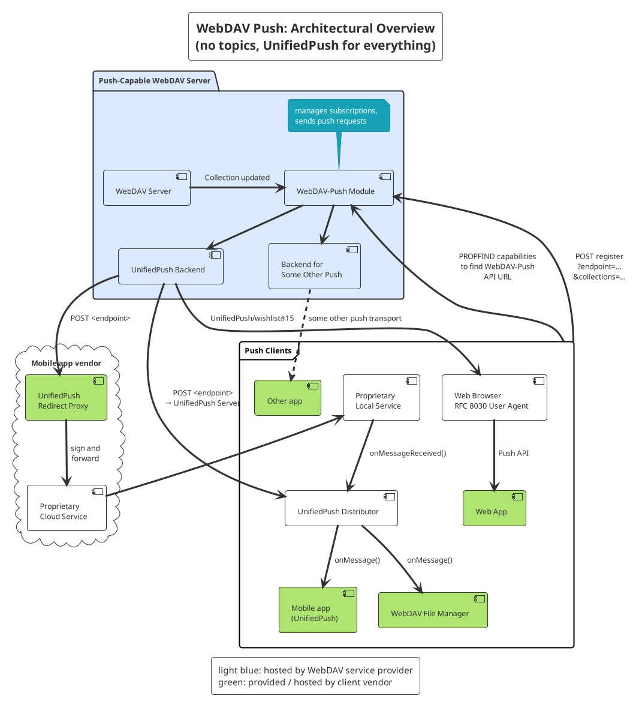

WebDAV Push

Draft Document (In Work)


# Introduction

This document, below referred to as _WebDAV-Push_, provides a way for compliant
WebDAV servers to send notifications about updated collections to subscribed clients
over existing push transports.

Capitalized words like Application Server, Client etc. have a special meaning in the context
of this document.

Typical use cases:

- mobile app synchronizes calendars/address books with device storage and wants to be notified on collection updates
- file manager lists contents of a WebDAV collection and wants to be notified on updates
- Calendar Web app shows a CalDAV collection and wants to be notified on updates


# Architectural overview



## WebDAV Server + WebDAV-Push Module

A WebDAV server that implements WebDAV-Push needs to

- advertise WebDAV-Push features and relevant information (service detection),
- manage subscriptions to collections and
- send push requests when a subscribed collection changes.


## Push Transports

WebDAV-Push isn't restricted to specific push services and allows clients to specify which push services
they support. This allows upcoming push services to be used with WebDav-Push.

However, WebDAV-Push currently suggests to implement at least

- [UnifiedPush](https://unifiedpush.org/) and
- [Web Push](https://www.rfc-editor.org/rfc/rfc8030) (maybe [not needed](https://github.com/UnifiedPush/wishlist/issues/15)).

UnifiedPush is an open set of specifications and allows push notifications to be delivered
over various transports

For proprietary push services (like Google FCM), client vendors may need to provide
a _rewrite proxy_ that signs and forwards the UnifiedPush requests to the respective
proprietary service.

A Web Push transport could support [Message Encryption](https://www.rfc-editor.org/rfc/rfc8291.html) and [VAPID](https://www.rfc-editor.org/rfc/rfc8292).


# Protocol definitions


Here we define how the communication between the components is done.


## Service detection: WebDAV

How clients can detect

- whether a collection supports WebDAV-Push,
- which push services are supported (may contain service-specific information)

> **TODO:** WebDAV properties

Example:
```
PROPFIND https://example.com/webdav/collection/
[…]
<propfind xmlns="DAV:" xmlns:P="WebDAV-Push">
  <prop>
    <P:push-transports/>
  </prop>
</propfind>

HTTP/1.1 207 Multi-Status
[…]
<multistatus xmlns="DAV:" xmlns:P="WebDAV-Push:">
  <response>
    <href>/webdav/collection/</href>
    <prop>
      <P:push-transports>
        <P:unifiedpush version="1"/>
        <P:web-push />
        <P:some-other-transport>
          <P:some-relevant-info>...<P:some-relevant-info>
        </P:some-other-transport>
      <P:push-transports>
    </prop>
  </response>
</multistatus>
```
In this case, the requested collection supports three push transports:

1. UnifiedPush (version 1)
2. Web Push (RFC 8030)
3. Some other transport, with some additional relevant information that is required to use it

## Subscription management

### Create subscription

How to subscribe to collections on the WebDAV server.

Required information:

- collection to be subscribed
- push transport, including transport-specific details
  - UnifiedPush: endpoint URL
  - Web Push: push resource URL
- expiration? how long by default, min/max (24 h), server decides (and can impose limits)

~~Depth header: not specified now because of complexity.~~ By now, only updates in direct members (equals `Depth: 1`) are sent. Maybe it could be specified that servers can send one notification per path segment? Implications?

URL + action query parameter like in [Managed Attachments](https://www.rfc-editor.org/rfc/rfc8607.html#section-3.3)?

Allowed response codes

Sample request for UnifiedPush:
```
POST https://example.com/webdav/collection/?action=push-subscribe
Content-Type: application/xml; charset="utf-8"

<?xml version="1.0" encoding="utf-8" ?>
<subscription xmlns="WebDAV-Push:">
  <transport>
    <unified-push>
      <endpoint>https://up.example.net/yohd4yai5Phiz1wi</endpoint>
    </unified-push>
  </transport>
  <expires>Wed, 20 Dec 2023 10:03:31 GMT</expires>
</subscription>

HTTP/1.1 204 No Content
```

Sample request for Web Push with Message Encryption:
```
POST https://example.com/webdav/collection/?action=push-subscribe
Content-Type: application/xml; charset="utf-8"

<?xml version="1.0" encoding="utf-8" ?>
<subscription xmlns="WebDAV-Push:">
  <transport>
    <web-push>
      <push-resource>https://push.example.net/push/JzLQ3raZJfFBR0aqvOMsLrt54w4rJUsV</push-resource>
      <public-key keyid="p256dh" dh="BL0IG_CKsOMezWrQPFQQDC39nRk88ROhz4Ytr9T-NZ7sbuHcjV0cVjoLtE7hR8c5USnRQ3LeKwuRxLvMVozJUt8" />
      <authentication-secret>c9_nEWEAI8JUnB_uh5uEbQ</authentication-secret>
    </web-push>
  </transport>
  <expires>Wed, 20 Dec 2023 10:03:31 GMT</expires>
</subscription>

HTTP/1.1 204 No Content
```

### Remove subscription

Works like creating a subscription, but with `action=remove-subscription`.

The server identifies the subscription by its details (for instance, the endpoint) and then removes it. If it can't find a matching subscription, it returns 404.


## Push messages

Actual push message format. As little data as possible, i.e. **only the changed topic**.

End-to-end encrypted, for instance as described by RFC 8291?

TTL?


# Security considerations

How sensitive are the data, how to minimize risks

What happens when information leaks

What happens when some component is hacked

Which information is shared with which component, especially public ones like the Google FCM + implications