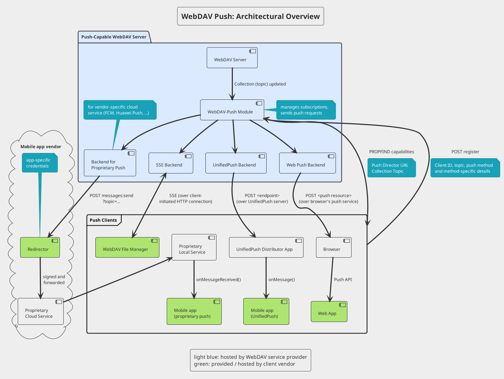
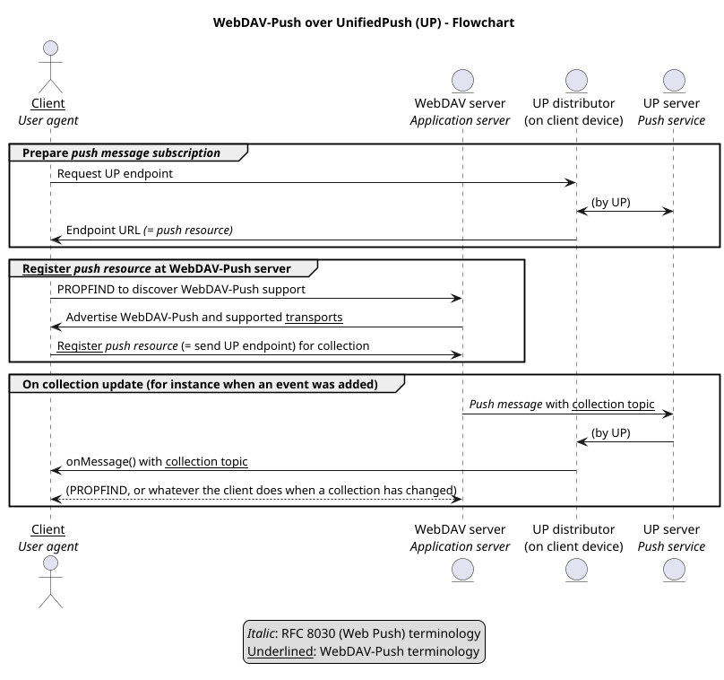

WebDAV Push – Draft Document (In Work)


# Introduction

This document, below referred to as _WebDAV-Push_, provides a way for compliant WebDAV servers to
send notifications about updated collections to subscribed clients over suitable push transports.

WebDAV-Push is intended as an additional tool to notify clients about updates in near time so 
that clients can refresh their views, perform synchronization etc.

A client should not rely solely on WebDAV-Push, so it should also perform regular polling like when
WebDAV-Push is not available. However if WebDAV-Push is available, the polling frequency can be
significantly reduced.

Typical use cases:

- A mobile app synchronizes calendars/address books with device-local storage and wants to be 
  notified on collection updates in order to re-synchronize.
- A desktop file manager shows contents of a WebDAV collection and wants to be notified on updates 
  in order to refresh the view.
- A calendar Web app shows a CalDAV collection and wants to be notified on updates in order to 
  refresh the view.


# Architectural overview




## WebDAV Server with support for WebDAV-Push

A WebDAV server that implements WebDAV-Push needs to

- advertise WebDAV-Push features and relevant information (service detection),
- manage subscriptions to collections and
- send push messages when a subscribed collection changes.

In order to manage subscriptions, a WebDAV server needs to

- provide a way for clients to subscribe to a collection (with transport-specific information),
- provide a way for clients to unsubscribe from collections,
- handle expired or otherwise invalid subscriptions.

Updates in collections have to be sent to all subscribed clients over the respective push
transports.

The server must be prepared to handle errors. For instance, if a push transport signals that a
subscription doesn't exist anymore, it must be removed and not be used again.


## Push transports

WebDAV-Push is not restricted to specific push transports and allows clients to specify which push
transports they support. This allows even upcoming, yet unknown push transports to be used with 
WebDAV-Push.

WebDAV-Push currently recommends to implement at least Web Push / RFC 8030 (see Appendix A).

For proprietary push services, client vendors may need to provide a _rewrite proxy_ that signs 
and forwards the requests to the respective proprietary service.

Push transport definitions can define extra properties and additional processing rules. For
instance, a transport definition could define that WebDAV servers should send an additional 
`Topic` header with their push notifications so that previous undelivered push messages are 
replaced by new ones.


# Protocol definitions


## Service detection: WebDAV

How clients can detect

- whether a collection supports WebDAV-Push,
- which push services are supported (may contain service-specific information)

**Element definitions:**

Name: `push-transports`  
Namespace: `DAV:Push`  
Purpose: Indicates which push transports are supported by the server.  
Definition: `<!ELEMENT push-transports (transport*)`  
Example: see below

Name: `transport`  
Namespace: `DAV:Push`  
Purpose: Specifies a push transport (like Web Push).  
Definition: `<!ELEMENT transport (web-push | %other-transport)`  
Example: see below

Name: `topic`  
Namespace: `DAV:Push`  
Purpose: Globally unique identifier for the collection.  
Description:

Notification messages contain the topic of the collection so that the client knows which collection
has changed. (URLs are not generally canonical, so that the collection URL without an explicit topic
would not be enough.)

Because the topic may be sent over push transports without encryption, it should not allow to draw
conclusions about the synchronized collection.

A client may register the same subscription for collections from multiple servers. When the client
receives a notification over such a shared subscription, the topic can be used to distinguish which
collection was updated. Because the client must be able to distinguish between collections from
different servers, the topics need to be globally unique.

Because the topic is used as `Topic` header when sent over a Web Push transport, the topic should
follow the rules of the RFC 8030 `Topic` header: no more than 32 characters from the URL and
filename-safe Base64 alphabet.

For instance, a server could use as a topic:

* a random GUID, encoded with base64url (defined in RFC 4648), for each collection; or
* a salted hash (constant server-specific salt) of the canonical collection URL, encoded with
  base64url.

Definition: `<!ELEMENT topic (#PCDATA)`  
Example: `<P:topic>O7M1nQ7cKkKTKsoS_j6Z3w</P:topic>`

Example:

```
PROPFIND https://example.com/webdav/collection/
<?xml version="1.0" encoding="utf-8" ?>
<propfind xmlns="DAV:" xmlns:P="DAV:Push">
  <prop>
    <P:push-transports/>
    <P:topic/>
  </prop>
</propfind>

HTTP/1.1 207 Multi-Status
<?xml version="1.0" encoding="utf-8" ?>
<multistatus xmlns="DAV:" xmlns:P="DAV:Push">
  <response>
    <href>/webdav/collection/</href>
    <prop>
      <P:push-transports>
        <P:transport><P:web-push /></P:transport>
        <P:transport>
          <P:some-other-transport>
            <P:some-relevant-info>...<P:some-relevant-info>
          </P:some-other-transport>
        </P:transport>
      </P:push-transports>
      <P:topic>O7M1nQ7cKkKTKsoS_j6Z3w</P:topic>
    </prop>
  </response>
</multistatus>
```

In this case, the requested collection supports two push transports:

1. Web Push (RFC 8030)
2. Some other transport, with some additional relevant information that is required to use it. This
   is to illustrate that it WebDAV-Push aims to support other or even yet unknown push transports,
   too.


## Subscription management

### Subscription registration

How to subscribe to collections on the WebDAV server. Required information:

- Collection to be subscribed
- Push transport, including transport-specific details
    - Web Push: push resource URL
    - (TODO details for message encryption)
- Expiration? how long by default, min/max (24 h), server decides (and can impose limits)
- (End-to-end-encryption? Or should it be defined per transport?)

TODO By now, only updates in direct members (equals `Depth: 1`) are sent. Maybe it could be 
specified that servers can send one notification per path segment? Implications?

To subscribe to a collection, the client sends a POST request with
`Content-Type: application/xml` to the collection it wants to subscribe. The root XML element of 
the XML body is `<push-register>` in the WebDAV-Push name space (`DAV:Push`) and can be used to 
distinguish between a WebDAV-Push and other requests.

### Subscription updates

A server must not register a subscription with the same identifier multiple times. Which
field is used as a unique identifier is specific to the transport. For Web Push, it is the push 
resource URL.

If a client tries to register a subscription with the same identifier again, the server must 
update the stored subscription with the subscription details and the expiration date. The server
can return either the same or a new registration URL for the updated subscription.

### Element definitions

Name: `push-register`  
Namespace: `DAV:Push`  
Purpose: Indicates that a subscription shall be registered to receive notifications when the
collection is updated.  
Description:

This element specifies details about a subscription that shall be notified when the collection is
updated. Besides the optional expiration, there must be exactly one `subscription` element that
defines the subscription details.

Definition: `<!ELEMENT push-register (expires?, subscription)`  
Example: see below

Name: `subscription`  
Namespace: `DAV:Push`  
Purpose: Specifies a subscription that shall be notified on updates. Contains exactly one element
with details about a specific subscription type. In this document, only the `web-push-subscription`
child element is defined.  
Definition: `<!ELEMENT subscription (web-push-subscription | %other-subscription)`  
Example: `<expires>Sun, 06 Nov 1994 08:49:37 GMT</expires>`

Name: `expires`  
Namespace: `DAV:Push`  
Purpose: Specifies an expiration date of the registered subscription.  
Description: Specifies an expiration date-time in the `IMF-fixdate` format (RFC 9110).  
Definition: `<!ELEMENT expires (#PCDATA)`  
Example: `<expires>Sun, 06 Nov 1994 08:49:37 GMT</expires>`

Allowed response codes:

* 201 if the subscription was created. The server may return additional information, like 
  encryption details that are only valid for this subscription. Details have to 
  be specified by the particular transport definition.
* other error code (should include `DAV:error` XML body)

When registering a subscription, the server creates a URL that identifies that registration
(_registration URL_). That URL is sent in the `Location` header and can be used to remove the
subscription.

Sample request for Web Push without message encryption:

```
POST https://example.com/webdav/collection/
Content-Type: application/xml; charset="utf-8"

<?xml version="1.0" encoding="utf-8" ?>
<push-register xmlns="DAV:Push">
  <subscription>
    <web-push-subscription>
      <push-resource>https://up.example.net/yohd4yai5Phiz1wi</push-resource>
    </web-push-subscription>
  </subscription>
  <expires>Wed, 20 Dec 2023 10:03:31 GMT</expires>
</push-register>

HTTP/1.1 201 Created
Location: https://example.com/webdav/subscriptions/io6Efei4ooph
```

### Subscription removal

A client can explicitly request subscription removal (unsubscribe) by sending a `DELETE` request to
its registration URL.

Sample request:

```
DELETE https://example.com/webdav/subscriptions/io6Efei4ooph

HTTP/1.1 204 OK
```

### Expiration

Clients can specify an expiration date-time when they register a subscription.

A server should take the expiration specified by a client into consideration, but may impose its
own (often stricter) expiration rules, for instance to keep their database clean or because the
client has specified an implausible late expiration.

Clients should refresh their registrations regularly because they can't rely on servers to keep
their subscriptions until the client-specified expiration date.

Expired subscriptions should be cleaned up and not be used anymore as chances are high that
notifying such subscriptions will cause errors.


## Push messages

The push message body contains the topic of the changed collection.

Sample push message body:

```
<?xml version="1.0" encoding="utf-8" ?>
<push-message xmlns="DAV:Push">
  <topic>O7M1nQ7cKkKTKsoS_j6Z3w</topic>
</push-message>
```

Push notification rate limit?

Shall end-to-end encryption (for instance as described by RFC 8291) be possible / recommended /
required?

Shall a TTL value, as used by Web Push, be recommended in general, per transport, or not at all?

Shall multiple enqueued (and not yet delivered) push messages for the same collection be merged to a
single one (like _Replacing push messages_ with the `Topic` header in RFC 8030)? Maybe use a
timestamp? Shall this be specified in general, per transport or not at all?


# Security considerations

Which information is shared with which party, especially public ones like the Google FCM +
implications? Involved parties:

* WebDAV server
* client
* push transports

Without E2EE, push transports can collect metadata:

* which WebDAV server notifies which clients,
* which clients are subscribed to the same collection (because they receive the same topic in the
  push message),
* at which times the collection is changed,
* other metadata (IP addresses etc.)

With E2EE, every push message is different and push transports can only relate clients over
heuristics, like the clients that are notified at the same time have probably subscribed the same
collection.

How sensitive are the data, how to minimize risks

What happens when information leaks

What happens when some component is hacked


# Appendix A: Web Push Transport

WebDAV-Push can be used with Web Push (RFC 8030) to deliver WebDAV-Push notifications directly to
compliant user agents, like Web browsers which come with their own push service infrastructure.
Currently (2024), all major browsers support Web Push.

When the Web Push transport is used for WebDAV-Push:

* RFC 8030 defines how to generate subscriptions and send push messages,
* the WebDAV-Push server acts as RFC 8030 Application Server,
* the WebDAV client (or a proxy server, for instance for proprietary environments) acts as RFC 8030
  User Agent.

Usage of Message Encryption (RFC 8291) and VAPID (RFC 8292) is recommended. If future protocol
extensions become used by push services, WebDAV-Push servers should implement them as well, if
applicable.

A WebDAV-Push server should use the collection topic as `Topic` header in push messages to replace
previous notifications for the same collection.

> **NOTE**: [UnifiedPush](https://unifiedpush.org/) (UP) is a set of specification documents which
> are intentionally designed as a 100% compatible subset of Web Push, together with a software that
> can be used to implement these documents. From a WebDAV-Push server perspective, UP endpoints can be
> seen as Web Push resources.




## Subscription

Element definitions:

Name: `web-push`  
Purpose: Specifies the Web Push transport.  
Description: Used to specify the Web Push Transport in the context of a `<transport>` element, for
instance in a list of supported transports.  
Definition: `<!ELEMENT web-push (EMPTY)`  
Example: `<web-push/>`

Name: `web-push-subscription`  
Purpose: Public information of a Web Push subscription that is shared with the WebDAV-Push server (
in terms of RFC 8030: application server).  
Description: Used to specify a Web Push subscription in the context of a `<subscription>` element,
for instance to register a subscription.  
Definition: `<!ELEMENT web-push-subscription (push-resource)`  
Example: see below

Name: `push-resource`  
Purpose: Identifies the endpoint where Web Push notifications are sent to (in terms of RFC 8030:
push resource).  
Definition: `<!ELEMENT push-resource (#PCDATA)`  
Example:

```
<web-push-subscription xmlns="DAV:Push">
  <push-resource>https://push.example.net/push/JzLQ3raZJfFBR0aqvOMsLrt54w4rJUsV</push-resource>
</web-push-subscription>
```

### Message encryption

> **TODO:** message encryption as defined in RFC 8291
